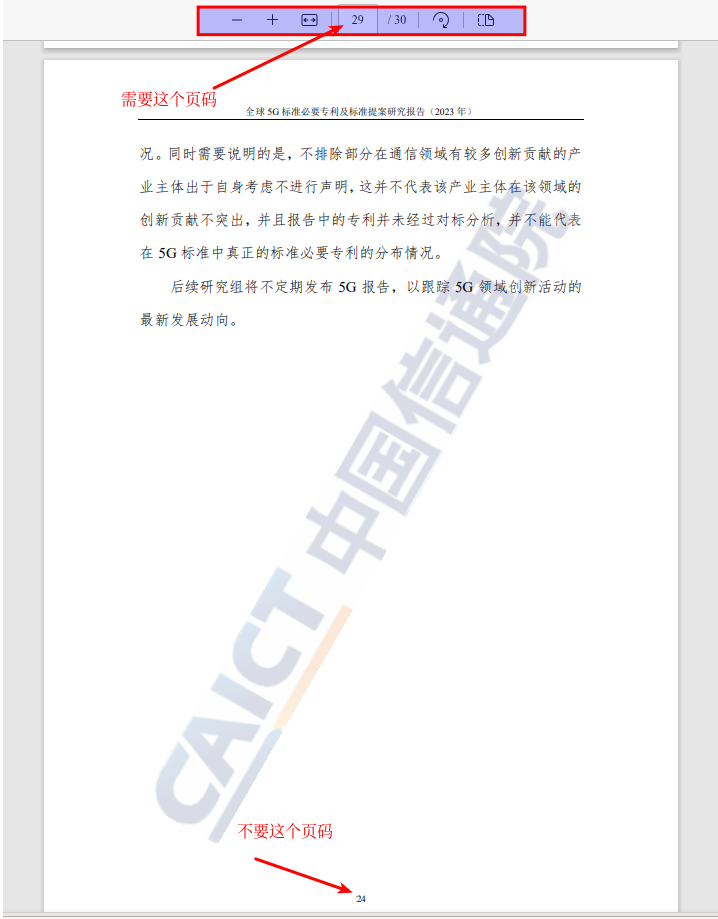

# PDF 水印去除工具

一个基于 Java 开发的 PDF 水印智能去除工具，采用两阶段处理流程，帮助用户精确移除 PDF 文档中的水印内容。

## 功能特点

- 🔍 **智能水印识别**：通过关键页分析技术，精准定位水印元素
- 🎯 **精确水印去除**：仅移除水印元素，保留原始文档内容和格式
- ⚡ **批量处理**：支持对整个 PDF 文档进行批量水印去除操作
- 📑 **保持原格式**：去除水印后完整保留文档的文本、图像和排版格式
- 🖥️ **命令行界面**：提供简单易用的命令行操作方式
- 🔄 **两阶段处理**：先识别水印元素，再批量移除，确保处理精度

## 实现原理

本工具采用先进的 PDF 元素分析技术，通过两阶段处理流程：

### 第一阶段：水印元素识别
1. **关键页分析**：用户指定包含水印的关键页，工具遍历该页所有元素
2. **元素剔除测试**：通过逐个剔除元素并生成测试页，确定水印元素特征
3. **生成测试文档**：输出包含多个测试页的 PDF 供用户确认

### 第二阶段：批量水印移除
1. **元素比对**：根据用户确认的水印消失页，精确定位水印元素
2. **模式识别**：在整个文档中识别所有匹配的水印元素
3. **批量处理**：从所有页面中移除匹配的水印元素
4. **文档重建**：生成无水印的新 PDF 文档，保持原文档完整性

## 安装要求

- Java 17 或更高版本
- 支持的操作系统：Windows、Linux、macOS
- 国内下载地址：[PDFWatermarkRemover.jar](https://gh-proxy.com/github.com/cuitpanfei/PDFWatermarkRemover/releases/download/v1.0/pdfkit-1.0-SNAPSHOT.jar)
- 国外下载地址：[PDFWatermarkRemover.jar](https://github.com/cuitpanfei/PDFWatermarkRemover/releases/download/v1.0/pdfkit-1.0-SNAPSHOT.jar)
- 下载后将文件重命名为`PDFWatermarkRemover.jar`

## 使用方法

### 基本命令格式

```bash
java -jar PDFWatermarkRemover.jar -f <文件路径> [-p <关键页>] [-t <水印消失页>]
```

### 参数说明

| 参数 | 全称 | 描述 | 是否必需 | 默认值 |
|------|------|------|----------|--------|
| `-f` | `-file-path` | 需要处理的 PDF 文件路径 | 是 | 无 |
| `-p` | `-key-page` | 关键页页码（浏览器打开后顶部显示的当前页码） | 否 | 1 |
| `-t` | `-key-token` | 水印消失的页码（确认水印消失的那一页） | 否 | 无 |
| `-h` | `-help` | 查看帮助信息 | 否 | 无 |
| `-v` | `-version` | 显示当前版本号 | 否 | 无 |

### 使用示例

1. **第一阶段：生成测试文档**
   ```bash
   java -jar PDFWatermarkRemover.jar -f sample.pdf -p 5
   ```
   此命令会处理关键页（第5页），生成一个包含多个测试页的PDF文件，文件名通常为`sample_output_0001.pdf`。

2. **第二阶段：完整处理**
   ```bash
   java -jar PDFWatermarkRemover.jar -f sample.pdf -t 8
   ```
   使用默认原PDF的关键页（第1页）和中间PDF文件上的水印消失页码（第8页）处理文档。

3. **查看帮助信息**
   ```bash
   java -jar PDFWatermarkRemover.jar -h
   ```

## 使用步骤

### 第一阶段：水印元素识别
0. 尽量选择内容少的页作为关键页，这个样生成的测试PDF文件页数才会少，也方便在测试PDF文件找到水印消失的页码
1. 运行工具，指定PDF文件路径和关键页参数（如`-f sample.pdf -p 5`）
2. 工具会生成一个测试PDF文件，文件名通常为原文件名加上`_output_0001`后缀
3. 打开测试PDF，浏览所有页面，找到水印完全消失的那一页
4. 记录水印消失页的页码（浏览器中显示的页码，非页面底部页码）
   

### 第二阶段：批量水印移除
1. 使用第一阶段获得的水印消失页码作为`-t`参数值
2. 运行工具，指定文件路径、关键页和水印消失页（如`-f sample.pdf -p 5 -t 8`）
3. 工具会处理整个文档，生成最终的无水印PDF文件
4. 保存的文件名通常为原文件名加上`_no_watermark`后缀

## 注意事项

- 关键页应选择包含完整水印内容的页面
- 水印消失页码是指在测试 PDF 中水印不再显示的那个页码
- 处理过程中会生成临时文件，请确保有足够的磁盘空间
- 建议在处理前备份原始 PDF 文件
- 如果水印由多个元素组成，可能需要多次运行工具才能完全去除

## 常见问题

**Q: 如何处理复杂水印或多元素水印？**
A: 对于复杂水印，可能需要多次运行工具。先处理主要水印元素，再处理次要元素。

**Q: 为什么处理后水印没有完全去除？**
A: 可能是水印由多个不同元素组成，需要分别识别和移除。请重复使用工具处理剩余水印元素。

**Q: 处理后的文档格式会发生变化吗？**
A: 工具会尽力保持原始格式，但极少数情况下可能会有些微变化，建议处理前后对比检查。

## 技术支持

如遇到使用问题或有功能建议，请联系开发团队或提交 Issue。

## 版本信息

当前版本：1.0.0

## 许可证

本项目采用 MIT 许可证，详情请参阅 LICENSE 文件。

---

**免责声明**：本工具仅限用于去除个人拥有合法使用权的文档中的水印。请遵守相关法律法规和版权协议，不得用于非法用途。